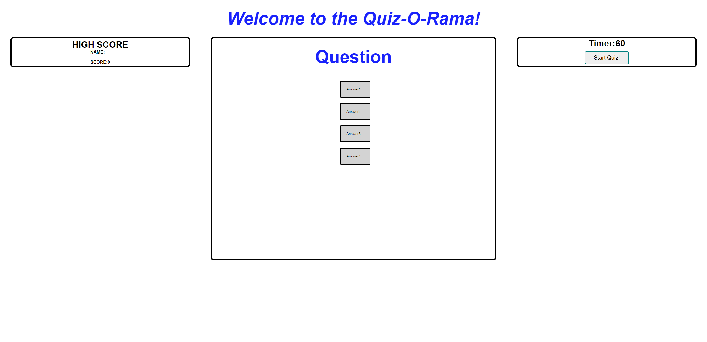

# Project Title

Weekly Challenge #4 01.03.21

Code Quiz

## Table of Contents
- [Description](#description)
- [Website Image](#website-image)
- [Website Link](#website-link)
- [Help](#Help)
- [Authors](#Authors)
- [Built With](#Built-With)
- [Version History](#Version-History)
- [Acknowledgments](#Acknowledgments)

## Description

This is the fourth weekly challenge assignment.  In this challenge, we are tasked to create code quiz, and caputure the high score and initals of the player.

## Website Image

## Website Link

(https://mwpx777.github.io/Code-Quiz/)

## Help

Please direct any issues or problems to mwpx777@gmail.com

## Authors

 Created by Mark Peterson

 MWP Designs

 [MWP Designs Instagram](https://instagram.com/mwp_designs)
 
 [MWP Designs LinkedIn](https://www.linkedin.com/in/mwpdesigns/)
 
 [MWP Designs Portfolio](https://mwpdigitaldesign.wixsite.com/portfolio)

## Built With

  [VS Code](https://code.visualstudio.com/)
	

## Version History

* 0.1
    * Initial Release 01.03.21

## Acknowledgments

